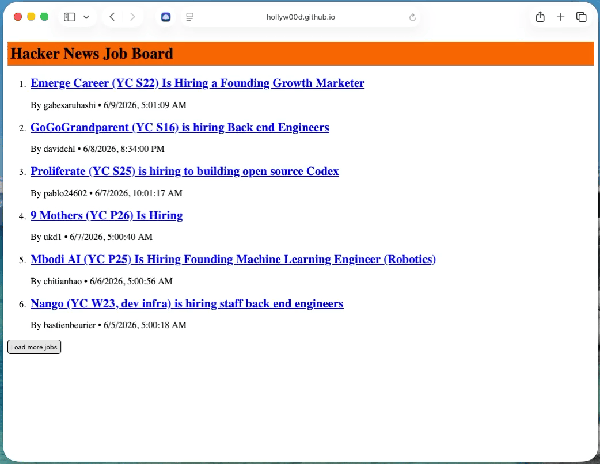
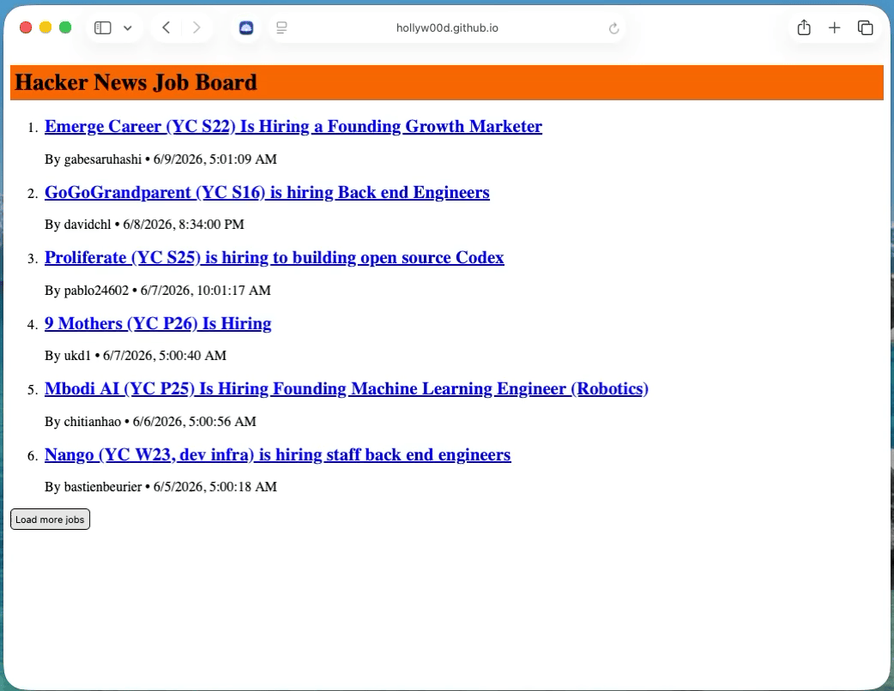

# Hacker News Job Board in React

This React app ([https://hollyw00d.github.io/hacker-news-job-board/](https://hollyw00d.github.io/hacker-news-job-board/)) pulls in jobs via the [Hacker News Jobs API](https://github.com/HackerNews/API) using:

- [React](https://react.dev/)
- [pnpm](https://pnpm.io/)
- [TanStack Query](https://tanstack.com/query/latest) (<code>useInfiniteQuery</code> hook)
- Accessibility testing on [VoiceOver screen reader](https://en.wikipedia.org/wiki/VoiceOver) for Mac on Safari browser

## Animated GIFs of the App

Hacker News Job Board React app in action:  

Hacker News Job Board React app using VoiceOver screen reader on a Mac with Safari browser:  

